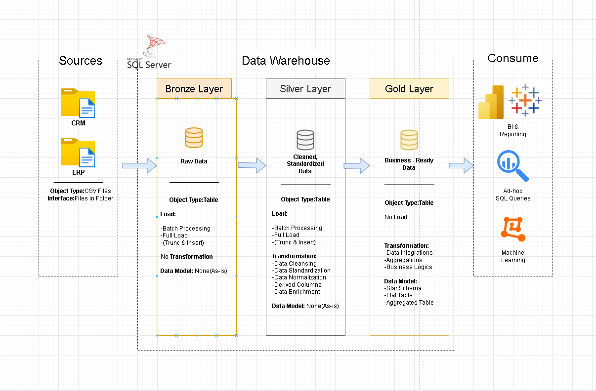
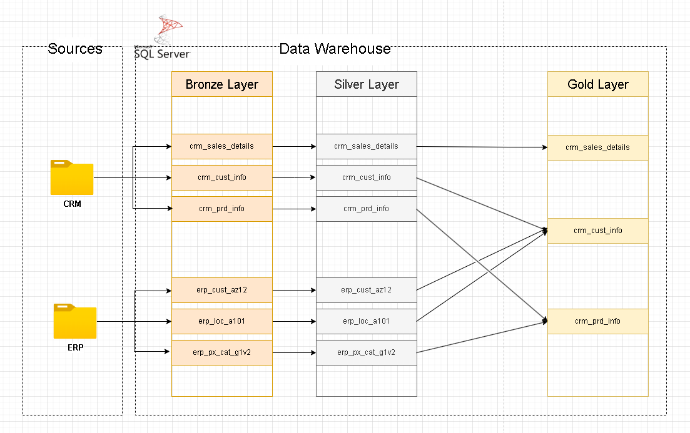

# 🏗️ SQL Data Warehouse Project 

A hands-on data warehouse built with **SQL Server** using the **Medallion Architecture** (Bronze → Silver → Gold), consolidating data from ERP and CRM source systems for analytical reporting.

---

## 📐 Architecture Overview

```
Bronze Layer  →  Silver Layer  →  Gold Layer
(Raw Ingest)     (Cleaned)        (Analytics-Ready)
```



---

## 🎯 Project Objectives

### 1. Build Data Warehouse (Data Engineering)
**Objective:** Develop a modern data warehouse using SQL Server to consolidate sales data, enabling analytical reporting and informed decision making.

**Specifications:**

| Area | Description |
|---|---|
| Data Sources | Import data from two source systems (ERP and CRM) provided as CSV files |
| Data Quality | Cleanse and resolve data quality issues prior to analysis |
| Integration | Combine both sources into a single, user-friendly data model designed for analytical queries |
| Scope | Focus on the latest dataset only; historization of data is not required |
| Documentation | Provide clear documentation of the data model to support both business stakeholders and analytics team |

### 2. BI: Analytics & Reporting (Data Analysis)
**Objective:** Develop SQL-based analytics to deliver detailed insights into:
- Customer Behaviour
- Product Performance
- Sales Trends

> These insights empower stakeholders with key business metrics, enabling strategic decision-making.

**Business Rules:**
> - `Sales = Quantity * Price`
> - Negative, Zeros, and NULLs are **not allowed**

---

## 🔄 Data Flow



---

## 📦 Source System Analysis

### CRM Tables

```
[cst_id], (cst_key), cst_firstname, cst_lastname, cst_marital_status, cst_gndr, cst_create_date
  └── cst_key = CID (joins to ERP)

Example: 11000, AW00011000, Jon, Yang, M, M, 2025-10-06
```

```
prd_id, {prd_key}, prd_nm, prd_cost, prd_line, prd_start_dt, prd_end_dt
  └── prd_key = sls_prd_key (joins to sales), prd_key = ID (joins to ERP category)

Example: 210, CO-RF-FR-R92B-58, HL Road Frame - Black- 58, , R, 2003-07-01
```

```
sls_ord_num, {sls_prd_key}, [sls_cust_id], sls_order_dt, sls_ship_dt, sls_due_dt, sls_sales, sls_quantity, sls_price
  └── sls_cust_id = cst_id (joins to customer)

Example: SO43697, BK-R93R-62, 21768, 20101229, 20110105, 20110110, 3578, 1, 3578
```

### ERP Tables

```
(CID), BDATE, GEN
  └── CID = cst_key (remove NAS prefix)

Example: NASAW00011000, 1971-10-06, Male
```

```
(CID), CNTRY
  └── CID = cst_key (remove dashes)

Example: AW-00011000, Australia
```

```
{ID}, CAT, SUBCAT, MAINTENANCE
  └── ID = prd_key (first 5 chars of prd_key, dashes replaced with underscores)

Example: AC_BR, Accessories, Bike Racks, Yes
```

---

## 🥉 Bronze Layer — Raw Ingestion

**Goal:** Load raw CSV data as-is into the database without transformation.

**Process:**
```
Analysing Source Systems
  → Coding Data Ingestion
    → Validating Data Completeness & Schema Checks
      → Docs & Version (draw.io + GIT)
```

**Key Questions When Analysing Source Systems:**
- Who owns the data? What business process does it support?
- How is data stored? (SQL Server, Oracle, AWS, Azure...)
- What are the integration capabilities? (API, Kafka, File Extract, Direct DB...)
- Incremental vs Full Loads? Data scope & historical needs?
- What is the expected size of the extracts?
- Authentication and authorization (tokens, SSH keys, VPN, IP whitelisting...)

---

### Step 1 — Create Database & Schemas

```sql
/*
=============================================================
Create Database and Schemas
=============================================================
Script Purpose:
    This script creates a new database named 'DataWarehouse' after checking if it already exists.
    If the database exists, it is dropped and recreated. Additionally, the script sets up three schemas
    within the database: 'bronze', 'silver', and 'gold'.

WARNING:
    Running this script will drop the entire 'DataWarehouse' database if it exists.
    All data in the database will be permanently deleted. Proceed with caution
    and ensure you have proper backups before running this script.
*/

IF EXISTS (SELECT 1 FROM sys.databases WHERE name = 'DataWarehouse')
BEGIN
    ALTER DATABASE DataWarehouse SET SINGLE_USER WITH ROLLBACK IMMEDIATE;
    DROP DATABASE DataWarehouse;
END;
GO

-- Create the 'DataWarehouse' database
CREATE DATABASE DataWarehouse;
GO

USE DataWarehouse;
GO

-- Create Schemas: bronze (raw), silver (cleaned), gold (analytics-ready)
CREATE SCHEMA bronze;
GO

CREATE SCHEMA silver;
GO

CREATE SCHEMA gold;
GO
```

---

### Step 2 — Bronze DDL (Create Tables)

```sql
-- Bronze tables mirror the CSV source exactly — no transformation, no cleaning

-- CRM: Customer Information
-- IF OBJECT_ID('bronze.crm_cust_info', 'U') IS NOT NULL
--     DROP TABLE bronze.crm_cust_info;
CREATE TABLE bronze.crm_cust_info (
    cst_id              INT,
    cst_key             NVARCHAR(50),
    cst_firstname       NVARCHAR(50),
    cst_lastname        NVARCHAR(50),
    cst_material_status NVARCHAR(50),
    cst_gndr            NVARCHAR(50),
    cst_create_date     DATE,
);

-- CRM: Product Information
CREATE TABLE bronze.crm_prd_info (
    prd_id       INT,
    prd_key      NVARCHAR(50),
    prd_nm       NVARCHAR(50),
    prd_cost     INT,
    prd_line     NVARCHAR(50),
    prd_start_dt DATETIME,
    prd_end_dt   DATETIME
);

-- CRM: Sales Details
-- Note: date columns stored as INT because source uses YYYYMMDD integer format (e.g. 20101229)
CREATE TABLE bronze.crm_sales_details (
    sls_ord_num  NVARCHAR(50),
    sls_prd_key  NVARCHAR(50),
    sls_cust_id  INT,
    sls_order_dt INT,
    sls_ship_dt  INT,
    sls_due_dt   INT,
    sls_sales    INT,
    sls_quantity INT,
    sls_price    INT
);

-- ERP: Customer (with birthdate and gender)
CREATE TABLE bronze.erp_cust_az12 (
    cid   NVARCHAR(50),
    bdate DATE,
    gen   NVARCHAR(50)
);

-- ERP: Location (customer country)
CREATE TABLE bronze.erp_loc_a101 (
    cid   NVARCHAR(50),
    cntry NVARCHAR(50)
);

-- ERP: Product Category
CREATE TABLE bronze.erp_px_cat_g1v2 (
    id          NVARCHAR(50),
    cat         NVARCHAR(50),
    subcat      NVARCHAR(50),
    maintenance NVARCHAR(50),
);
```

---

### Step 3 — Bronze Load (Stored Procedure)

```sql
-- Stored procedure performs full reload (truncate + BULK INSERT) for all 6 bronze tables
-- Uses @start_time / @end_time per table and @batch_start_time for total duration logging
CREATE OR ALTER PROCEDURE bronze.load_bronze AS
BEGIN
    DECLARE @start_time DATETIME, @end_time DATETIME, @batch_start_time DATETIME, @batch_end_time DATETIME;
    BEGIN TRY
        SET @batch_start_time = GETDATE();
        PRINT 'Loading Bronze Layer';
        PRINT '=====================================';

        PRINT 'Loading CRM Tables';
        PRINT '-------------------------------------';

        -- Load: crm_cust_info
        SET @start_time = GETDATE();
        PRINT 'Truncating Table: bronze.crm_cust_info';
        TRUNCATE TABLE bronze.crm_cust_info;
        PRINT 'Inserting Data Into: bronze.crm_cust_info';
        BULK INSERT bronze.crm_cust_info
        FROM 'D:\Finished project\sql-datawarehouse-project\sql-warehouse-project\sql-data-warehouse-project\datasets\source_crm\cust_info.csv'
        WITH (
            FIRSTROW = 2,           -- Skip header row
            FIELDTERMINATOR = ',',
            TABLOCK
        );
        SET @end_time = GETDATE();
        PRINT 'Load Duration: ' + CAST(DATEDIFF(second, @start_time, @end_time) AS NVARCHAR) + ' seconds';
        PRINT '--------------------------------------------';

        -- Load: crm_prd_info
        SET @start_time = GETDATE();
        PRINT 'Truncating Table: bronze.crm_prd_info';
        TRUNCATE TABLE  bronze.crm_prd_info;
        PRINT 'Inserting Data Into: bronze.crm_prd_info';
        BULK INSERT bronze.crm_prd_info
        FROM 'D:\Finished project\sql-datawarehouse-project\sql-warehouse-project\sql-data-warehouse-project\datasets\source_crm\prd_info.csv'
        WITH (
            FIRSTROW = 2,
            FIELDTERMINATOR = ',',
            TABLOCK
        );
        SET @end_time = GETDATE();
        PRINT 'Load Duration: ' + CAST(DATEDIFF(second, @start_time, @end_time) AS NVARCHAR) + ' seconds';
        PRINT '--------------------------------------------';

        -- Load: crm_sales_details
        SET @start_time = GETDATE();
        PRINT 'Truncating Table: bronze.crm_sales_details';
        TRUNCATE TABLE bronze.crm_sales_details;
        PRINT 'Inserting Data Into: bronze.crm_sales_details';
        BULK INSERT bronze.crm_sales_details
        FROM 'D:\Finished project\sql-datawarehouse-project\sql-warehouse-project\sql-data-warehouse-project\datasets\source_crm\sales_details.csv'
        WITH (
            FIRSTROW = 2,
            FIELDTERMINATOR = ',',
            TABLOCK
        );
        SET @end_time = GETDATE();
        PRINT 'Load Duration: ' + CAST(DATEDIFF(second, @start_time, @end_time) AS NVARCHAR) + ' seconds';
        PRINT '--------------------------------------------';

        PRINT 'Loading ERP Tables';
        PRINT '-------------------------------------';

        -- Load: erp_cust_az12
        SET @start_time = GETDATE();
        PRINT 'Truncating Table: bronze.erp_cust_az12';
        TRUNCATE TABLE bronze.erp_cust_az12;
        PRINT 'Inserting Data Into: bronze.erp_cust_az12';
        BULK INSERT bronze.erp_cust_az12
        FROM 'D:\Finished project\sql-datawarehouse-project\sql-warehouse-project\sql-data-warehouse-project\datasets\source_erp\CUST_AZ12.csv'
        WITH (
            FIRSTROW = 2,
            FIELDTERMINATOR = ',',
            TABLOCK
        );
        SET @end_time = GETDATE();
        PRINT 'Load Duration: ' + CAST(DATEDIFF(second, @start_time, @end_time) AS NVARCHAR) + ' seconds';
        PRINT '--------------------------------------------';

        -- Load: erp_loc_a101
        SET @start_time = GETDATE();
        PRINT 'Truncating Table: bronze.erp_loc_a101';
        TRUNCATE TABLE bronze.erp_loc_a101;
        PRINT 'Inserting Data Into: bronze.erp_loc_a101';
        BULK INSERT bronze.erp_loc_a101
        FROM 'D:\Finished project\sql-datawarehouse-project\sql-warehouse-project\sql-data-warehouse-project\datasets\source_erp\LOC_A101.csv'
        WITH (
            FIRSTROW = 2,
            FIELDTERMINATOR = ',',
            TABLOCK
        );
        SET @end_time = GETDATE();
        PRINT 'Load Duration: ' + CAST(DATEDIFF(second, @start_time, @end_time) AS NVARCHAR) + ' seconds';
        PRINT '--------------------------------------------';

        -- Load: erp_px_cat_g1v2
        SET @start_time = GETDATE();
        PRINT 'Truncating Table: bronze.erp_px_cat_g1v2';
        TRUNCATE TABLE bronze.erp_px_cat_g1v2;
        PRINT 'Inserting Data Into: bronze.erp_px_cat_g1v2';
        BULK INSERT bronze.erp_px_cat_g1v2
        FROM 'D:\Finished project\sql-datawarehouse-project\sql-warehouse-project\sql-data-warehouse-project\datasets\source_erp\PX_CAT_G1V2.csv'
        WITH (
            FIRSTROW = 2,
            FIELDTERMINATOR = ',',
            TABLOCK
        );
        SET @end_time = GETDATE();
        PRINT 'Load Duration: ' + CAST(DATEDIFF(second, @start_time, @end_time) AS NVARCHAR) + ' seconds';
        PRINT '--------------------------------------------';

        SET @batch_end_time = GETDATE();
        PRINT 'Loading Bronze Layer is Completed';
        PRINT ' - Total Load Duration: ' + CAST(DATEDIFF(second, @batch_start_time, @batch_end_time) AS NVARCHAR) + ' seconds';
        PRINT '--------------------------------------------';
    END TRY
    BEGIN CATCH
        -- Capture and display error details if any step fails
        PRINT 'ERROR OCCURED DURING LOADING BRONZE LAYER';
        PRINT 'Error Message' + ERROR_MESSAGE();
        PRINT 'Error Number ' + CAST(ERROR_NUMBER() AS NVARCHAR(10));
        PRINT 'Error State ' + CAST(ERROR_STATE() AS NVARCHAR(10));
    END CATCH
END

-- Execute the bronze load procedure
EXEC bronze.load_bronze

-- Quick validation: spot-check first 100 rows after load
SELECT TOP 100
    *
FROM bronze.crm_cust_info;
```

---

## 🥈 Silver Layer — Data Cleansing

**Goal:** Cleanse, standardize, and deduplicate bronze data. Apply business rules.

**Process:**
```
Analysing → Coding Data Cleansing → Validating Data Correctness → Documenting & Versioning in GIT
```

.png)

---

### Step 4 — Silver DDL (Create Tables)

```sql
-- Silver tables add dwh_create_date for auditability
-- Columns are typed correctly (e.g., dates as DATE instead of INT)

-- Silver: Customer Info (adds dwh_create_date audit column)
CREATE TABLE silver.crm_cust_info (
    cst_id              INT,
    cst_key             NVARCHAR(50),
    cst_firstname       NVARCHAR(50),
    cst_lastname        NVARCHAR(50),
    cst_material_status NVARCHAR(50),
    cst_gndr            NVARCHAR(50),
    cst_create_date     DATE,
    dwh_create_date     DATETIME2 DEFAULT GETDATE() -- Audit: when record entered the warehouse
);

IF OBJECT_ID('silver.crm_prd_info', 'U') IS NOT NULL
    DROP TABLE silver.crm_prd_info;
-- Silver: Product Info (adds cat_id derived column, correct DATE types)
CREATE TABLE silver.crm_prd_info (
    prd_id          INT,
    cat_id          NVARCHAR(50),  -- Derived from prd_key (first 5 chars)
    prd_key         NVARCHAR(50),
    prd_nm          NVARCHAR(50),
    prd_cost        INT,
    prd_line        NVARCHAR(50),
    prd_start_dt    DATE,          -- Corrected from DATETIME to DATE
    prd_end_dt      DATE,          -- Derived via LEAD() window function
    dwh_create_date DATETIME2 DEFAULT GETDATE()
);

IF OBJECT_ID('silver.crm_sales_details', 'U') IS NOT NULL
    DROP TABLE silver.crm_sales_details;
-- Silver: Sales Details (dates corrected from INT YYYYMMDD to DATE)
CREATE TABLE silver.crm_sales_details (
    sls_ord_num     NVARCHAR(50),
    sls_prd_key     NVARCHAR(50),
    sls_cust_id     INT,
    sls_order_dt    DATE,          -- Converted from INT
    sls_ship_dt     DATE,
    sls_due_dt      DATE,
    sls_sales       INT,
    sls_quantity    INT,
    sls_price       INT,
    dwh_create_date DATETIME2 DEFAULT GETDATE()
);

-- Silver: ERP Customer
CREATE TABLE silver.erp_cust_az12 (
    cid             NVARCHAR(50),
    bdate           DATE,
    gen             NVARCHAR(50),
    dwh_create_date DATETIME2 DEFAULT GETDATE()
);

-- Silver: ERP Location
CREATE TABLE silver.erp_loc_a101 (
    cid             NVARCHAR(50),
    cntry           NVARCHAR(50),
    dwh_create_date DATETIME2 DEFAULT GETDATE()
);

-- Silver: ERP Product Category
CREATE TABLE silver.erp_px_cat_g1v2 (
    id              NVARCHAR(50),
    cat             NVARCHAR(50),
    subcat          NVARCHAR(50),
    maintenance     NVARCHAR(50),
    dwh_create_date DATETIME2 DEFAULT GETDATE()
);
```

---

### Step 5 — Silver Data Quality Checks & Cleaning

#### crm_cust_info

```sql
-- ============================================================
-- DQ Check 1: NULLs or Duplicates in Primary Key
-- Expectation: No Result
-- ============================================================
SELECT
    cst_id,
    COUNT(1)
--FROM bronze.crm_cust_info   -- Run on bronze first to find issues
FROM silver.crm_cust_info     -- Then re-run on silver to confirm they're fixed
GROUP BY cst_id
HAVING COUNT(1) > 1 OR cst_id IS NULL

-- ============================================================
-- DQ Check 2: Duplicate deep-dive (ROW_NUMBER to find non-latest records)
-- flag_last = 1 means most recent record per customer
-- ============================================================
SELECT
    *
FROM (
    SELECT
        *,
        ROW_NUMBER() OVER(PARTITION BY cst_id ORDER BY cst_create_date DESC) flag_last
    --FROM bronze.crm_cust_info
    FROM silver.crm_cust_info
    WHERE cst_id IS NOT NULL
) t
--WHERE flag_last = 1     -- Only latest records
WHERE flag_last != 1      -- Show duplicates (older records that should be excluded)

-- ============================================================
-- DQ Check 3: Unwanted Leading/Trailing Spaces
-- Expectation: No Results
-- ============================================================
SELECT
    cst_firstname
    --cst_lastname
--FROM bronze.crm_cust_info
FROM silver.crm_cust_info
WHERE cst_firstname != TRIM(cst_firstname)
--WHERE cst_lastname != TRIM(cst_lastname)

-- ============================================================
-- DQ Check 4: Data Standardization & Consistency (inspect distinct values)
-- ============================================================
SELECT
    DISTINCT cst_gndr
    --DISTINCT cst_marital_status
--FROM bronze.crm_cust_info
FROM silver.crm_cust_info

-- Quick preview of silver table
SELECT TOP 100
    *
FROM silver.crm_cust_info

-- ============================================================
-- Cleaning: Truncate silver and insert cleaned data from bronze
-- Transformations applied:
--   1. TRIM whitespace from name fields
--   2. Normalize marital_status: S→Single, M→Married, else n/a
--   3. Normalize gender: F→Female, M→Male, else n/a
--   4. Deduplicate: keep only the most recent record per cst_id (flag_last = 1)
--   5. Exclude NULLs in primary key
-- ============================================================
TRUNCATE TABLE silver.crm_cust_info;
INSERT INTO silver.crm_cust_info (
    cst_id,
    cst_key,
    cst_firstname,
    cst_lastname,
    cst_marital_status,
    cst_gndr,
    cst_create_date
)
SELECT
     [cst_id]
    ,[cst_key]
    ,TRIM(cst_firstname) cst_firstname
    ,TRIM(cst_lastname) cst_lastname
    ,CASE UPPER(TRIM(cst_marital_status))
        WHEN 'S' THEN 'Single'
        WHEN 'M' THEN 'Married'
        ELSE 'n/a'
     END cst_marital_status   -- Normalize marital status values to readable format
    ,CASE UPPER(TRIM(cst_gndr))
        WHEN 'F' THEN 'Female'
        WHEN 'M' THEN 'Male'
        ELSE 'n/a'
     END cst_gndr             -- Normalize gender values to readable format
    ,[cst_create_date]
FROM (
    SELECT
        *,
        ROW_NUMBER() OVER(PARTITION BY cst_id ORDER BY cst_create_date DESC) flag_last -- Select the most recent record per customer
    FROM bronze.crm_cust_info
    WHERE cst_id IS NOT NULL
) t
WHERE flag_last = 1;
```

#### crm_prd_info

```sql
-- ============================================================
-- DQ Check 1: NULLs or Duplicates in Primary Key
-- Expectation: No Result
-- ============================================================
SELECT
    prd_id,
    COUNT(1)
--FROM bronze.crm_prd_info
FROM silver.crm_prd_info
GROUP BY prd_id
HAVING COUNT(1) > 1 OR prd_id IS NULL

-- ============================================================
-- DQ Check 2: Unwanted spaces in product name
-- Expectation: No Results
-- ============================================================
SELECT
    prd_nm
--FROM bronze.crm_prd_info
FROM silver.crm_prd_info
WHERE prd_nm != TRIM(prd_nm)

-- ============================================================
-- DQ Check 3: Negative Numbers or NULLs in cost
-- Expectation: No Results (business rule: no negatives/NULLs)
-- ============================================================
SELECT prd_cost
--FROM bronze.crm_prd_info
FROM silver.crm_prd_info
WHERE prd_cost < 0 OR prd_cost IS NULL

-- ============================================================
-- DQ Check 4: Data Standardization — distinct product lines
-- ============================================================
SELECT
    DISTINCT prd_line
--FROM bronze.crm_prd_info
FROM silver.crm_prd_info

-- ============================================================
-- DQ Check 5: Invalid Date Orders (end before start)
-- Expectation: No Results
-- ============================================================
SELECT *
--FROM bronze.crm_prd_info
FROM silver.crm_prd_info
WHERE prd_end_dt < prd_start_dt

-- ============================================================
-- Cleaning: Truncate silver and insert cleaned data from bronze
-- Transformations applied:
--   1. Derive cat_id by extracting first 5 chars of prd_key and replacing '-' with '_'
--   2. Extract actual prd_key starting from char 7 (removes cat prefix)
--   3. Replace NULL prd_cost with 0 (ISNULL)
--   4. Normalize prd_line codes to full descriptive names
--   5. Cast prd_start_dt from DATETIME to DATE
--   6. Derive prd_end_dt using LEAD(): one day before the next product version's start date
-- ============================================================
TRUNCATE TABLE silver.crm_prd_info;
INSERT INTO [silver].[crm_prd_info]
           ([prd_id]
           ,[cat_id]
           ,[prd_key]
           ,[prd_nm]
           ,[prd_cost]
           ,[prd_line]
           ,[prd_start_dt]
           ,[prd_end_dt])
SELECT
     [prd_id]
    ,REPLACE(SUBSTRING(prd_key, 1, 5), '-', '_') cat_id              -- Extract category id from prd_key (derived column)
    ,SUBSTRING(prd_key, 7, LEN(prd_key)) prd_key                     -- Extract product key (separate it from cat_id)
    ,[prd_nm]
    ,ISNULL(prd_cost, 0) prd_cost                                     -- If there's NULL change value to 0
    ,CASE UPPER(TRIM(prd_line))
        WHEN 'M' THEN 'Mountain'
        WHEN 'R' THEN 'Road'
        WHEN 'S' THEN 'Other Sales'
        WHEN 'T' THEN 'Touring'
        ELSE 'n/a'
     END prd_line                                                      -- Map prd_line to descriptive values
    ,CAST(prd_start_dt AS DATE) prd_start_dt                          -- Changing DATETIME to DATE
    ,CAST(LEAD(prd_start_dt) OVER(PARTITION BY prd_key ORDER BY prd_start_dt) -1 AS DATE) prd_end_dt -- Calculate prd_end_date as one day before the next start date (data enrichment)
FROM [DataWarehouse].[bronze].[crm_prd_info];
-- Useful diagnostic queries (commented out):
--WHERE REPLACE(SUBSTRING(prd_key, 1, 5), '-', '_') NOT IN
--  (SELECT DISTINCT id FROM bronze.erp_px_cat_g1v2)          -- Find unmatched categories
--WHERE SUBSTRING(prd_key, 7, LEN(prd_key)) NOT IN
--  (SELECT sls_prd_key FROM bronze.crm_sales_details)         -- Find products not in sales
```

#### crm_sales_details

```sql
-- ============================================================
-- DQ Check 1: Invalid Dates (zero, negative, or wrong length)
-- Source stores dates as INT in YYYYMMDD format (e.g. 20101229)
-- ============================================================
SELECT sls_order_dt
--FROM bronze.crm_sales_details
WHERE sls_order_dt <= 0 OR LEN(sls_order_dt) != 8

-- ============================================================
-- DQ Check 2: Invalid Date Orders
-- order_dt must be before ship_dt and due_dt
-- Expectation: No Results
-- ============================================================
SELECT *
--FROM bronze.crm_sales_details
FROM silver.crm_sales_details
WHERE sls_order_dt > sls_ship_dt OR sls_order_dt > sls_due_dt

-- ============================================================
-- DQ Check 3: Business Rule — Sales = Quantity * Price
-- Values must not be NULL, zero, or negative
-- ============================================================
SELECT
    sls_sales,
    sls_quantity,
    sls_price
--FROM bronze.crm_sales_details
FROM silver.crm_sales_details
WHERE sls_sales != sls_quantity * sls_price
   OR sls_sales IS NULL OR sls_quantity IS NULL OR sls_price IS NULL
   OR sls_sales <= 0 OR sls_quantity <= 0 OR sls_price <= 0
ORDER BY sls_sales, sls_quantity, sls_price

-- Quick preview
SELECT TOP 20
    *
FROM silver.crm_sales_details

-- ============================================================
-- Cleaning: Truncate silver and insert cleaned data from bronze
-- Transformations applied:
--   1. Convert INT date (YYYYMMDD) to proper DATE, set invalid dates to NULL
--   2. Recalculate sls_sales if NULL, <=0, or mismatched with quantity*price
--   3. Recalculate sls_price from sales/quantity if NULL or <=0
--   4. Use ABS() to handle negative prices/sales
--   5. Use NULLIF to prevent divide-by-zero errors
-- ============================================================
TRUNCATE TABLE silver.crm_sales_details;
INSERT INTO silver.crm_sales_details (
     [sls_ord_num]
    ,[sls_prd_key]
    ,[sls_cust_id]
    ,[sls_order_dt]
    ,[sls_ship_dt]
    ,[sls_due_dt]
    ,[sls_sales]
    ,[sls_quantity]
    ,[sls_price]
)
SELECT
     [sls_ord_num]
    ,[sls_prd_key]
    ,[sls_cust_id]
    ,CASE
        WHEN sls_order_dt <= 0 OR LEN(sls_order_dt) != 8 THEN NULL -- Handling invalid data
        ELSE CAST(CAST(sls_order_dt AS VARCHAR) AS DATE)            -- Cast from INT→VARCHAR→DATE
     END sls_order_dt
    ,CASE
        WHEN sls_ship_dt <= 0 OR LEN(sls_ship_dt) != 8 THEN NULL
        ELSE CAST(CAST(sls_ship_dt AS VARCHAR) AS DATE)
     END sls_ship_dt
    ,CASE
        WHEN sls_due_dt <= 0 OR LEN(sls_due_dt) != 8 THEN NULL
        ELSE CAST(CAST(sls_due_dt AS VARCHAR) AS DATE)
     END sls_due_dt
    ,CASE
        WHEN sls_sales IS NULL OR sls_sales <= 0 OR sls_sales != sls_quantity * ABS(sls_price) -- Handling invalid data
        THEN sls_quantity * ABS(sls_price)  -- Use formula (doing calculation) to make derived value
        ELSE sls_sales
     END sls_sales
    ,[sls_quantity]
    ,CASE
        WHEN sls_price IS NULL OR sls_price <= 0
        THEN ABS(sls_sales) / NULLIF(sls_quantity, 0)  -- Avoid divide-by-zero with NULLIF
        ELSE sls_price
     END sls_price
FROM [bronze].[crm_sales_details];
-- Useful diagnostic queries (commented out):
--WHERE sls_cust_id NOT IN (SELECT cst_id FROM silver.crm_cust_info)  -- Orphaned customers
--WHERE sls_prd_key NOT IN (SELECT prd_key FROM silver.crm_prd_info)  -- Orphaned products
--WHERE sls_ord_num != TRIM(sls_ord_num)                              -- Whitespace in order numbers
```

#### erp_cust_az12

```sql
-- ============================================================
-- DQ Check 1: Out-of-Range Birthdates
-- Rule: No one born before 1926 or in the future
-- ============================================================
SELECT DISTINCT
    bdate
FROM silver.erp_cust_az12
WHERE bdate < '1926-01-01' OR bdate > GETDATE()

-- ============================================================
-- DQ Check 2: Gender value standardization
-- ============================================================
SELECT DISTINCT
    gen
--FROM bronze.erp_cust_az12
FROM silver.erp_cust_az12

-- ============================================================
-- Cleaning: Truncate silver and insert cleaned data from bronze
-- Transformations applied:
--   1. Strip 'NAS' prefix from cid if present (so it matches CRM cst_key)
--   2. Set out-of-range birthdates to NULL
--   3. Normalize gender: F/FEMALE→Female, M/MALE→Male, else n/a
-- ============================================================
TRUNCATE TABLE silver.erp_cust_az12;
INSERT INTO silver.erp_cust_az12 (cid, bdate, gen)
SELECT
    CASE
        WHEN cid LIKE 'NAS%' THEN SUBSTRING(cid, 4, LEN(cid)) -- Remove NAS prefix if present
        ELSE cid
    END cid,
    CASE
        WHEN bdate < '1926-01-01' OR bdate > GETDATE()          -- Set 100+ year olds and future birthdates to NULL
        THEN NULL
        ELSE bdate
    END bdate,
    CASE
        WHEN UPPER(TRIM(gen)) IN ('F', 'FEMALE') THEN 'Female'  -- Normalize gender values and handle unknown cases
        WHEN UPPER(TRIM(gen)) IN ('M', 'MALE') THEN 'Male'
        ELSE 'n/a'
    END gen
FROM bronze.erp_cust_az12;

SELECT TOP 20
    *
FROM silver.erp_cust_az12
```

#### erp_loc_a101

```sql
-- ============================================================
-- DQ Check 1: Country value standardization (inspect distinct values)
-- ============================================================
SELECT DISTINCT
    cntry
--FROM bronze.erp_loc_a101
FROM silver.erp_loc_a101

-- ============================================================
-- Cleaning: Truncate silver and insert cleaned data from bronze
-- Transformations applied:
--   1. Remove dashes from cid (so 'AW-00011000' matches CRM 'AW00011000')
--   2. Map country codes: DE→Germany, US/USA→United States
--   3. Set empty or NULL countries to 'n/a'
-- ============================================================
TRUNCATE TABLE silver.erp_loc_a101;
INSERT INTO silver.erp_loc_a101
(cid, cntry)
SELECT
    REPLACE(cid, '-', '') cid,      -- Standardize cid so it matches counterpart in other tables
    CASE
        WHEN TRIM(cntry) = 'DE' THEN 'Germany'
        WHEN TRIM(cntry) IN ('US', 'USA') THEN 'United States' -- Normalize and handle missing values or NULLs
        WHEN TRIM(cntry) IS NULL OR cntry = '' THEN 'n/a'
        ELSE TRIM(cntry)
    END cntry
FROM bronze.erp_loc_a101;
```

#### erp_px_cat_g1v2

```sql
-- ============================================================
-- DQ Check 1: Unwanted spaces in any column
-- ============================================================
SELECT *
FROM bronze.erp_px_cat_g1v2
--FROM silver.erp_px_cat_g1v2
WHERE subcat != TRIM(subcat) OR cat != TRIM(cat) OR maintenance != TRIM(maintenance)

-- ============================================================
-- DQ Check 2: Inspect distinct subcategories
-- ============================================================
SELECT DISTINCT
    --cat
    TRIM(subcat)
FROM bronze.erp_px_cat_g1v2

-- ============================================================
-- Cleaning: Truncate silver and insert from bronze
-- No major transformations needed for this table — data is already clean
-- ============================================================
TRUNCATE TABLE silver.erp_px_cat_g1v2;
INSERT INTO silver.erp_px_cat_g1v2
(id, cat, subcat, maintenance)
SELECT
     [id]
    ,[cat]
    ,[subcat]
    ,[maintenance]
FROM [bronze].[erp_px_cat_g1v2];
```

---

### Step 6 — Silver Load (Stored Procedure)

```sql
-- Stored procedure wraps all bronze → silver transformations in a single executable
-- Includes per-table and total batch timing, plus structured error handling
CREATE OR ALTER PROCEDURE silver.load_silver AS
BEGIN
    DECLARE @start_time DATETIME, @end_time DATETIME, @batch_start_time DATETIME, @batch_end_time DATETIME;
    BEGIN TRY
        SET @batch_start_time = GETDATE();
        PRINT 'Loading Silver Layer';
        PRINT '=====================================';

        PRINT 'Loading CRM Tables';
        PRINT '-------------------------------------';

        -- Load: silver.crm_cust_info
        SET @start_time = GETDATE();
        PRINT 'Truncating Table: silver.crm_cust_info';
        TRUNCATE TABLE silver.crm_cust_info;
        PRINT 'Inserting Data Into: silver.crm_cust_info';
        INSERT INTO silver.crm_cust_info (
            cst_id,
            cst_key,
            cst_firstname,
            cst_lastname,
            cst_marital_status,
            cst_gndr,
            cst_create_date
        )
        SELECT
             [cst_id]
            ,[cst_key]
            ,TRIM(cst_firstname) cst_firstname
            ,TRIM(cst_lastname) cst_lastname
            ,CASE UPPER(TRIM(cst_marital_status))
                WHEN 'S' THEN 'Single'
                WHEN 'M' THEN 'Married'
                ELSE 'n/a'
             END cst_marital_status -- Normalize marital status values to readable format
            ,CASE UPPER(TRIM(cst_gndr))
                WHEN 'F' THEN 'Female'
                WHEN 'M' THEN 'Male'
                ELSE 'n/a'
             END cst_gndr           -- Normalize gender values to readable format
            ,[cst_create_date]
        FROM (
            SELECT
                *,
                ROW_NUMBER() OVER(PARTITION BY cst_id ORDER BY cst_create_date DESC) flag_last -- Select the most recent record per customer
            FROM bronze.crm_cust_info
            WHERE cst_id IS NOT NULL
        ) t
        WHERE flag_last = 1;
        SET @end_time = GETDATE();
        PRINT 'Load Duration: ' + CAST(DATEDIFF(second, @start_time, @end_time) AS NVARCHAR) + ' seconds';
        PRINT '--------------------------------------------';

        -- Load: silver.crm_prd_info
        SET @start_time = GETDATE();
        PRINT 'Truncating Table: silver.crm_prd_info';
        TRUNCATE TABLE silver.crm_prd_info;
        PRINT 'Inserting Data Into: silver.crm_prd_info';
        INSERT INTO [silver].[crm_prd_info]
                   ([prd_id]
                   ,[cat_id]
                   ,[prd_key]
                   ,[prd_nm]
                   ,[prd_cost]
                   ,[prd_line]
                   ,[prd_start_dt]
                   ,[prd_end_dt])
        SELECT
             [prd_id]
            ,REPLACE(SUBSTRING(prd_key, 1, 5), '-', '_') cat_id   -- Extract category id from prd_key (derived column)
            ,SUBSTRING(prd_key, 7, LEN(prd_key)) prd_key           -- Extract product key (separate it from cat_id)
            ,[prd_nm]
            ,ISNULL(prd_cost, 0) prd_cost                          -- If there's NULL change value to 0
            ,CASE UPPER(TRIM(prd_line))
                WHEN 'M' THEN 'Mountain'
                WHEN 'R' THEN 'Road'
                WHEN 'S' THEN 'Other Sales'
                WHEN 'T' THEN 'Touring'
                ELSE 'n/a'
             END prd_line                                           -- Map prd_line to descriptive values
            ,CAST(prd_start_dt AS DATE) prd_start_dt               -- Changing DATETIME to DATE
            ,CAST(LEAD(prd_start_dt) OVER(PARTITION BY prd_key ORDER BY prd_start_dt) -1 AS DATE) prd_end_dt -- Calculate prd_end_date as one day before the next start date (data enrichment)
        FROM [DataWarehouse].[bronze].[crm_prd_info];
        SET @end_time = GETDATE();
        PRINT 'Load Duration: ' + CAST(DATEDIFF(second, @start_time, @end_time) AS NVARCHAR) + ' seconds';
        PRINT '--------------------------------------------';

        -- Load: silver.crm_sales_details
        SET @start_time = GETDATE();
        PRINT 'Truncating Table: silver.crm_sales_details';
        TRUNCATE TABLE silver.crm_sales_details;
        PRINT 'Inserting Data Into: silver.crm_sales_details';
        INSERT INTO silver.crm_sales_details (
             [sls_ord_num]
            ,[sls_prd_key]
            ,[sls_cust_id]
            ,[sls_order_dt]
            ,[sls_ship_dt]
            ,[sls_due_dt]
            ,[sls_sales]
            ,[sls_quantity]
            ,[sls_price]
        )
        SELECT
             [sls_ord_num]
            ,[sls_prd_key]
            ,[sls_cust_id]
            ,CASE
                WHEN sls_order_dt <= 0 OR LEN(sls_order_dt) != 8 THEN NULL -- Handling invalid data
                ELSE CAST(CAST(sls_order_dt AS VARCHAR) AS DATE)            -- Cast from VARCHAR to DATE
             END sls_order_dt
            ,CASE
                WHEN sls_ship_dt <= 0 OR LEN(sls_ship_dt) != 8 THEN NULL
                ELSE CAST(CAST(sls_ship_dt AS VARCHAR) AS DATE)
             END sls_ship_dt
            ,CASE
                WHEN sls_due_dt <= 0 OR LEN(sls_due_dt) != 8 THEN NULL
                ELSE CAST(CAST(sls_due_dt AS VARCHAR) AS DATE)
             END sls_due_dt
            ,CASE
                WHEN sls_sales IS NULL OR sls_sales <= 0 OR sls_sales != sls_quantity * ABS(sls_price) -- Handling invalid data
                THEN sls_quantity * ABS(sls_price) -- Use formula (doing calculation) to make derived value
                ELSE sls_sales
             END sls_sales
            ,[sls_quantity]
            ,CASE
                WHEN sls_price IS NULL OR sls_price <= 0
                THEN ABS(sls_sales) / NULLIF(sls_quantity, 0)
                ELSE sls_price
             END sls_price
        FROM [bronze].[crm_sales_details];
        SET @end_time = GETDATE();
        PRINT 'Load Duration: ' + CAST(DATEDIFF(second, @start_time, @end_time) AS NVARCHAR) + ' seconds';
        PRINT '--------------------------------------------';

        PRINT 'Loading ERP Tables';
        PRINT '-------------------------------------';

        -- Load: silver.erp_cust_az12
        SET @start_time = GETDATE();
        PRINT 'Truncating Table: silver.erp_cust_az12';
        TRUNCATE TABLE silver.erp_cust_az12;
        PRINT 'Inserting Data Into: silver.erp_cust_az12';
        INSERT INTO silver.erp_cust_az12 (cid, bdate, gen)
        SELECT
            CASE
                WHEN cid LIKE 'NAS%' THEN SUBSTRING(cid, 4, LEN(cid)) -- Remove NAS prefix if present
                ELSE cid
            END cid,
            CASE
                WHEN bdate < '1926-01-01' OR bdate > GETDATE()          -- Set 100 year olds and future birthdate to NULL
                THEN NULL
                ELSE bdate
            END bdate,
            CASE
                WHEN UPPER(TRIM(gen)) IN ('F', 'FEMALE') THEN 'Female'  -- Normalize gender values and handle unknown cases
                WHEN UPPER(TRIM(gen)) IN ('M', 'MALE') THEN 'Male'
                ELSE 'n/a'
            END gen
        FROM bronze.erp_cust_az12;
        PRINT 'Load Duration: ' + CAST(DATEDIFF(second, @start_time, @end_time) AS NVARCHAR) + ' seconds';
        PRINT '--------------------------------------------';

        -- Load: silver.erp_loc_a101
        SET @start_time = GETDATE();
        PRINT 'Truncating Table: silver.erp_loc_a101';
        TRUNCATE TABLE silver.erp_loc_a101;
        PRINT 'Inserting Data Into: silver.erp_loc_a101';
        INSERT INTO silver.erp_loc_a101
        (cid, cntry)
        SELECT
            REPLACE(cid, '-', '') cid, -- Standardization so value is the same with counterpart on other table
            CASE
                WHEN TRIM(cntry) = 'DE' THEN 'Germany'
                WHEN TRIM(cntry) IN ('US', 'USA') THEN 'United States' -- Normalize and Handle missing value or NULLs
                WHEN TRIM(cntry) IS NULL OR cntry = '' THEN 'n/a'
                ELSE TRIM(cntry)
            END cntry
        FROM bronze.erp_loc_a101;
        PRINT 'Load Duration: ' + CAST(DATEDIFF(second, @start_time, @end_time) AS NVARCHAR) + ' seconds';
        PRINT '--------------------------------------------';

        -- Load: silver.erp_px_cat_g1v2
        SET @start_time = GETDATE();
        PRINT 'Truncating Table: silver.erp_px_cat_g1v2';
        TRUNCATE TABLE silver.erp_px_cat_g1v2;
        PRINT 'Inserting Data Into: silver.erp_px_cat_g1v2';
        INSERT INTO silver.erp_px_cat_g1v2
        (id, cat, subcat, maintenance)
        SELECT
             [id]
            ,[cat]
            ,[subcat]
            ,[maintenance]
        FROM [bronze].[erp_px_cat_g1v2];
        PRINT 'Load Duration: ' + CAST(DATEDIFF(second, @start_time, @end_time) AS NVARCHAR) + ' seconds';
        PRINT '--------------------------------------------';

        SET @batch_end_time = GETDATE();
        PRINT 'Loading Silver Layer is Completed';
        PRINT ' - Total Load Duration: ' + CAST(DATEDIFF(second, @batch_start_time, @batch_end_time) AS NVARCHAR) + ' seconds';
        PRINT '--------------------------------------------';
    END TRY
    BEGIN CATCH
        -- Structured error output for debugging
        PRINT 'ERROR OCCURED DURING LOADING SILVER LAYER';
        PRINT 'Error Message' + ERROR_MESSAGE();
        PRINT 'Error Number ' + CAST(ERROR_NUMBER() AS NVARCHAR(10));
        PRINT 'Error State ' + CAST(ERROR_STATE() AS NVARCHAR(10));
    END CATCH
END

-- Execute the silver load procedure
EXEC silver.load_silver
```

---

## 🥇 Gold Layer — Analytics-Ready Views

**Goal:** Create business-friendly views using a Star Schema. No physical tables — gold objects are **views** that read from silver.

**Process:**
```
Analysing Business Objects
  → Coding Data Integration
    → Validating Data Integration Checks
      → Document Star Schema (draw.io)
        → Create Data Catalog
```

.png)

---

### Step 7 — Gold Layer (Views)

#### gold.dim_customers

```sql
-- Dimension: Customers
-- Integrates CRM customer info with ERP birthdate/gender (erp_cust_az12)
-- and ERP country (erp_loc_a101)
-- Surrogate key (customer_key) generated with ROW_NUMBER() since no PK exists in source

-- Diagnostic: check for gender conflicts between CRM and ERP before creating view
SELECT DISTINCT
    ci.cst_gndr,
    ca.gen
FROM silver.crm_cust_info ci
LEFT JOIN silver.erp_cust_az12 ca
ON ci.cst_key = ca.cid
LEFT JOIN silver.erp_loc_a101 la
ON ci.cst_key = la.cid

-- Maintenance helper
EXEC sp_updatestats;
DBCC SHOWCONTIG;

CREATE VIEW gold.dim_customers AS
SELECT
    ROW_NUMBER() OVER(ORDER BY ci.cst_id) AS customer_key  -- Surrogate key (no natural PK in warehouse)
    ,ci.cst_id          AS customer_id
    ,ci.cst_key         AS customer_number
    ,ci.cst_firstname   AS first_name
    ,ci.cst_lastname    AS last_name
    ,la.cntry           AS country
    ,ci.cst_marital_status AS marital_status
    ,CASE
        WHEN ci.cst_gndr != 'n/a' THEN ci.cst_gndr        -- CRM is the Master for gender info
        ELSE COALESCE(ca.gen, 'n/a')                        -- Fall back to ERP if CRM gender is unknown
     END AS gender
    ,ca.bdate           AS birthdate
    ,ci.cst_create_date AS create_date
FROM silver.crm_cust_info ci
LEFT JOIN silver.erp_cust_az12 ca
ON ci.cst_key = ca.cid
LEFT JOIN silver.erp_loc_a101 la
ON ci.cst_key = la.cid

-- Validation: check distinct gender values in the final view
SELECT DISTINCT gender FROM gold.dim_customers
```

#### gold.dim_products

```sql
-- Dimension: Products
-- Integrates CRM product info with ERP product categories (erp_px_cat_g1v2)
-- Only current products are included (prd_end_dt IS NULL filters out historical versions)
-- Surrogate key (product_key) generated with ROW_NUMBER()

CREATE VIEW gold.dim_products AS
SELECT
    ROW_NUMBER() OVER(ORDER BY pn.prd_start_dt, pn.prd_key) product_key  -- Surrogate key
    ,pn.prd_id      product_id
    ,pn.prd_key     product_number
    ,pn.prd_nm      product_name
    ,pn.cat_id      category_id
    ,pc.cat         category
    ,pc.subcat      subcategory
    ,pc.maintenance
    ,pn.prd_cost    product_cost
    ,pn.prd_line    product_line
    ,pn.prd_start_dt 'start_date'
FROM silver.crm_prd_info pn
LEFT JOIN silver.erp_px_cat_g1v2 pc
ON pn.cat_id = pc.id
WHERE pn.prd_end_dt IS NULL -- Filter out all historical data (only current product versions)
```

#### gold.fact_sales

```sql
-- Fact Table: Sales
-- Uses surrogate keys from dimension views (product_key, customer_key)
-- instead of raw IDs — this is the Star Schema join pattern

CREATE VIEW gold.fact_sales AS
SELECT
     sd.sls_ord_num  order_number
    ,pr.product_key                -- FK → gold.dim_products
    ,cu.customer_key               -- FK → gold.dim_customers
    ,sd.sls_order_dt order_date
    ,sd.sls_ship_dt  shipping_date
    ,sd.sls_due_dt   due_date
    ,sd.sls_sales    sales_amount
    ,sd.sls_quantity quantity
    ,sd.sls_price    price
FROM silver.crm_sales_details sd
LEFT JOIN gold.dim_products pr
ON sd.sls_prd_key = pr.product_number
LEFT JOIN gold.dim_customers cu
ON sd.sls_cust_id = cu.customer_id

-- ============================================================
-- Foreign Key Integrity Check
-- Expectation: No results (all sales rows should link to a valid product and customer)
-- ============================================================
SELECT *
FROM gold.fact_sales s
LEFT JOIN gold.dim_customers c
ON s.customer_key = c.customer_key
LEFT JOIN gold.dim_products p
ON s.product_key = p.product_key
--WHERE c.customer_key IS NULL   -- Orphaned customers
WHERE p.product_key IS NULL      -- Orphaned products
```

---

### Step 8 — Data Catalog


```sql
-- ============================================================
-- Data Catalog: gold.dim_customers
-- ============================================================
SELECT
    [customer_key]      -- INT        | Surrogate key uniquely identifying each customer record in the dimension table
  , [customer_id]       -- INT        | Natural/business identifier assigned to each customer
  , [customer_number]   -- NVARCHAR   | Alphanumeric identifier used for tracking and referencing customers
  , [first_name]        -- NVARCHAR   | Customer's given name
  , [last_name]         -- NVARCHAR   | Customer's family name
  , [country]           -- NVARCHAR   | Country of residence or registration
  , [marital_status]    -- NVARCHAR   | Customer's marital status (e.g., Single, Married)
  , [gender]            -- NVARCHAR   | Gender of the customer (e.g., Male, Female)
  , [birthdate]         -- DATE       | Date of birth of the customer
  , [create_date]       -- DATETIME   | Date when the customer record was created in the warehouse
FROM [DataWarehouse].[gold].[dim_customers];


-- ============================================================
-- Data Catalog: gold.dim_products
-- ============================================================
SELECT
    [product_key]       -- INT        | Surrogate key uniquely identifying each product record in the dimension table
  , [product_id]        -- INT        | Natural/business identifier assigned to each product
  , [product_number]    -- NVARCHAR   | Alphanumeric identifier used for tracking and referencing products
  , [product_name]      -- NVARCHAR   | Name of the product
  , [category_id]       -- NVARCHAR   | Identifier for the product's category
  , [category]          -- NVARCHAR   | Name of the product category (e.g., Components, Bikes)
  , [subcategory]       -- NVARCHAR   | Subdivision of the category for finer classification
  , [maintenance]       -- NVARCHAR   | Indicates maintenance status (e.g., Yes, No)
  , [product_cost]      -- INT        | Cost of producing or acquiring the product
  , [product_line]      -- NVARCHAR   | Product line grouping (e.g., Road, Mountain)
  , [start_date]        -- DATE       | Date when the product became available
FROM [DataWarehouse].[gold].[dim_products];


-- ============================================================
-- Data Catalog: gold.fact_sales
-- ============================================================
SELECT
    [order_number]      -- NVARCHAR   | Unique identifier for the sales order
  , [product_key]       -- INT        | Foreign key linking to gold.dim_products.product_key
  , [customer_key]      -- INT        | Foreign key linking to gold.dim_customers.customer_key
  , [order_date]        -- DATE       | Date when the order was placed
  , [shipping_date]     -- DATE       | Date when the order was shipped
  , [due_date]          -- DATE       | Expected delivery or payment due date
  , [sales_amount]      -- INT        | Total monetary value of the sales transaction (Quantity * Price)
  , [quantity]          -- INT        | Number of product units sold
  , [price]             -- INT        | Unit price of the product at the time of sale
FROM [DataWarehouse].[gold].[fact_sales];
```

---

## 📊 Analytics & Reporting (BI Layer)

This section covers the analytical queries built on top of the Gold layer, progressing from basic exploration to advanced analytics and reusable reporting views.

---

### Step 9 — Database & Dimension Exploration

```sql
-- ============================================================
-- Explore all tables available in the database
-- ============================================================
SELECT * FROM INFORMATION_SCHEMA.TABLES

-- ============================================================
-- Explore all columns of a specific table
-- ============================================================
SELECT * FROM INFORMATION_SCHEMA.COLUMNS
WHERE TABLE_NAME = 'dim_customers'

-- ============================================================
-- Dimension Exploration: distinct countries customers come from
-- ============================================================
SELECT DISTINCT country FROM gold.dim_customers

-- ============================================================
-- Dimension Exploration: full product hierarchy (category → subcategory → product)
-- ============================================================
SELECT DISTINCT category, subcategory, product_name FROM gold.dim_products
ORDER BY 1, 2, 3
```

---

### Step 10 — Date Exploration

```sql
-- ============================================================
-- Find the first and last order date, and how many years/months of sales data exist
-- ============================================================
SELECT
    MIN(order_date) first_order_date,
    MAX(order_date) last_order_date,
    DATEDIFF(year,  MIN(order_date), MAX(order_date)) orderdt_ranges_years,
    DATEDIFF(month, MIN(order_date), MAX(order_date)) orderdt_ranges_months
FROM gold.fact_sales

-- ============================================================
-- Find the youngest and oldest customer, and the age range across all customers
-- Note: MIN(birthdate) = oldest person; MAX(birthdate) = youngest person
-- ============================================================
SELECT
    MIN(birthdate)                                    youngest_customer,
    MAX(birthdate)                                    oldest_customer,
    DATEDIFF(year, MIN(birthdate), MAX(birthdate))    customers_age_range,
    DATEDIFF(year, MIN(birthdate), GETDATE())         oldest_customer,
    DATEDIFF(year, MAX(birthdate), GETDATE())         youngest_customer
FROM gold.dim_customers
```

---

### Step 11 — Measures Exploration (Key Business Metrics)

```sql
-- ============================================================
-- High-level measures: total sales, quantity, avg price, total orders
-- ============================================================
SELECT
    SUM(sales_amount)           total_sales,
    SUM(quantity)               total_quantity,
    AVG(price)                  avg_price,
    COUNT(DISTINCT order_number) total_orders
FROM gold.fact_sales

-- Total number of products in the catalog
SELECT
    COUNT(product_name) total_products
FROM gold.dim_products

-- Total number of customers registered
SELECT
    COUNT(customer_key) total_customers
FROM gold.dim_customers

-- Total number of customers who have actually placed at least one order
SELECT
    COUNT(DISTINCT customer_key) total_customers
FROM gold.fact_sales

-- ============================================================
-- Business KPI Summary Report — all key metrics in one result set
-- Uses UNION ALL to pivot multiple aggregations into measure_name / measure_value rows
-- ============================================================
SELECT 'Total Sales'                measure_name, SUM(sales_amount)              measure_value FROM gold.fact_sales
UNION ALL
SELECT 'Total Quantity',                           SUM(quantity)                               FROM gold.fact_sales
UNION ALL
SELECT 'Average Price',                            AVG(price)                                  FROM gold.fact_sales
UNION ALL
SELECT 'Total Orders',                             COUNT(DISTINCT order_number)                FROM gold.fact_sales
UNION ALL
SELECT 'Total Products',                           COUNT(product_name)                         FROM gold.dim_products
UNION ALL
SELECT 'Total Customers',                          COUNT(customer_key)                         FROM gold.dim_customers
UNION ALL
SELECT 'Total Customers that Order',               COUNT(DISTINCT customer_key)                FROM gold.fact_sales
```

---

### Step 12 — Magnitude Analysis (Compare Metrics by Category)

```sql
-- ============================================================
-- Total customers by country — who are our biggest markets?
-- ============================================================
SELECT
    country,
    COUNT(customer_key) total_customers
FROM gold.dim_customers
GROUP BY country
ORDER BY total_customers DESC

-- Total customers by gender
SELECT
    gender,
    COUNT(customer_key) total_customers
FROM gold.dim_customers
GROUP BY gender
ORDER BY total_customers DESC

-- Total products by category
SELECT
    category,
    COUNT(product_key) total_products
FROM gold.dim_products
GROUP BY category
ORDER BY total_products DESC

-- Average product cost per category
SELECT
    category,
    AVG(product_cost) avg_cost
FROM gold.dim_products
GROUP BY category
ORDER BY avg_cost DESC

-- ============================================================
-- Total revenue generated per category (requires join to fact table)
-- ============================================================
SELECT
    p.category,
    SUM(s.sales_amount) total_revenue
FROM gold.fact_sales s
LEFT JOIN gold.dim_products p
ON s.product_key = p.product_key
GROUP BY p.category
ORDER BY total_revenue DESC

-- Total revenue generated per individual customer
SELECT
    c.customer_key,
    c.first_name,
    c.last_name,
    SUM(s.sales_amount) total_revenue
FROM gold.fact_sales s
LEFT JOIN gold.dim_customers c
ON s.customer_key = c.customer_key
GROUP BY c.customer_key, c.first_name, c.last_name
ORDER BY total_revenue DESC

-- Distribution of items sold across countries
SELECT
    c.country,
    SUM(quantity) item_sold
FROM gold.fact_sales s
LEFT JOIN gold.dim_customers c
ON s.customer_key = c.customer_key
GROUP BY c.country
ORDER BY item_sold DESC
```

---

### Step 13 — Ranking: Top N / Bottom N

```sql
-- ============================================================
-- Top 5 products by revenue — using ROW_NUMBER() inside a subquery
-- ROW_NUMBER() used instead of TOP so rank can be filtered after aggregation
-- ============================================================
SELECT *
FROM (
    SELECT
        p.product_name,
        SUM(s.sales_amount) total_revenue,
        ROW_NUMBER() OVER(ORDER BY SUM(s.sales_amount) DESC) rev_rank
    FROM gold.fact_sales s
    LEFT JOIN gold.dim_products p
    ON s.product_key = p.product_key
    GROUP BY p.product_name
) t
WHERE rev_rank <= 5

-- ============================================================
-- Bottom 5 worst-performing products by revenue
-- Note: ORDER BY ASC in OVER() to rank lowest first
-- ============================================================
SELECT *
FROM (
    SELECT TOP 5
        p.product_name,
        SUM(s.sales_amount) total_revenue,
        ROW_NUMBER() OVER(ORDER BY SUM(s.sales_amount)) rev_rank  -- ASC = lowest revenue first
    FROM gold.fact_sales s
    LEFT JOIN gold.dim_products p
    ON s.product_key = p.product_key
    GROUP BY p.product_name
) t
WHERE rev_rank <= 5

-- Top 10 customers by revenue
SELECT TOP 10
    c.customer_key,
    c.first_name,
    c.last_name,
    SUM(s.sales_amount) total_revenue
FROM gold.fact_sales s
LEFT JOIN gold.dim_customers c
ON s.customer_key = c.customer_key
GROUP BY c.customer_key, c.first_name, c.last_name
ORDER BY total_revenue DESC

-- Quick check: top 10 individual sales transactions
SELECT TOP 10
    sales_amount
FROM gold.fact_sales

-- ============================================================
-- 3 customers with the fewest orders placed (least engaged customers)
-- ============================================================
SELECT TOP 3
    c.customer_key,
    c.first_name,
    c.last_name,
    COUNT(DISTINCT order_number) total_orders
FROM gold.fact_sales s
LEFT JOIN gold.dim_customers c
ON s.customer_key = c.customer_key
GROUP BY c.customer_key, c.first_name, c.last_name
ORDER BY total_orders
```

---

### Step 14 — Advanced Analytics

#### Change Over Time (Trends)

```sql
-- ============================================================
-- Yearly sales trend: total sales, unique customers, and quantity over time
-- DATETRUNC(year) normalizes all dates to Jan 1 of that year for grouping
-- FORMAT() provides a human-readable label alongside the truncated date
-- ============================================================
SELECT
    DATETRUNC(year, order_date) order_date,
    FORMAT(order_date, 'yyyy-MMM') order_date2,
    SUM(sales_amount)             total_sales,
    COUNT(DISTINCT customer_key)  total_customers,
    SUM(quantity)                 total_quantity
FROM gold.fact_sales
WHERE order_date IS NOT NULL
GROUP BY DATETRUNC(year, order_date), FORMAT(order_date, 'yyyy-MMM')
ORDER BY DATETRUNC(year, order_date), FORMAT(order_date, 'yyyy-MMM')
```

#### Cumulative Analysis (Running Totals)

```sql
-- ============================================================
-- Running total of sales and moving average price over time
-- Uses window functions without PARTITION BY so the window spans all prior years
-- Subquery pre-aggregates by year before applying window functions
-- ============================================================
SELECT
    order_year,
    total_sales,
    SUM(total_sales) OVER(ORDER BY order_year) running_total_sales,  -- Cumulative sum
    AVG(avg_price)   OVER(ORDER BY order_year) moving_avg_price      -- Moving average
FROM (
    SELECT
        DATETRUNC(year, order_date) order_year,
        SUM(sales_amount)           total_sales,
        AVG(price)                  avg_price
    FROM gold.fact_sales
    WHERE order_date IS NOT NULL
    GROUP BY DATETRUNC(year, order_date)
) t;
```

#### Year-over-Year Performance Analysis

```sql
/* 
Analyze the Yearly Performance of Products by Comparing their Sales to Both:
  - The Average Sale Performance of the Product (across all years)
  - The Previous Year's Sales (YoY delta)
Uses CTE + window functions: AVG() OVER(PARTITION BY) and LAG() OVER(PARTITION BY ORDER BY)
*/
WITH yearly_product_sales AS (
    SELECT
        YEAR(s.order_date) order_year,
        p.product_name,
        SUM(s.sales_amount) total_sales
    FROM gold.fact_sales s
    LEFT JOIN gold.dim_products p
    ON s.product_key = p.product_key
    WHERE order_date IS NOT NULL
    GROUP BY YEAR(s.order_date), p.product_name
)
SELECT
    order_year,
    product_name,
    total_sales,
    AVG(total_sales) OVER(PARTITION BY product_name) avg_sales,                          -- Avg across all years for this product
    total_sales - AVG(total_sales) OVER(PARTITION BY product_name) diff_avg,             -- Deviation from that average
    CASE
        WHEN total_sales - AVG(total_sales) OVER(PARTITION BY product_name) > 0 THEN 'Above Average'
        WHEN total_sales - AVG(total_sales) OVER(PARTITION BY product_name) < 0 THEN 'Below Average'
        ELSE 'Avg'
    END avg_change,
    LAG(total_sales) OVER(PARTITION BY product_name ORDER BY order_year) py_sales,       -- Previous year's sales
    total_sales - LAG(total_sales) OVER(PARTITION BY product_name ORDER BY order_year) diff_py,
    CASE
        WHEN total_sales - LAG(total_sales) OVER(PARTITION BY product_name ORDER BY order_year) > 0 THEN 'Increase'  -- YoY Analysis
        WHEN total_sales - LAG(total_sales) OVER(PARTITION BY product_name ORDER BY order_year) < 0 THEN 'Decrease'
        ELSE 'No Change'
    END py_change
FROM yearly_product_sales
ORDER BY product_name, order_year
```

#### Part-to-Whole (Proportional Contribution)

```sql
-- ============================================================
-- Which categories contribute the most to overall sales?
-- SUM() OVER() with no ORDER BY gives the grand total for percentage calculation
-- ============================================================
WITH category_sales AS (
    SELECT
        p.category,
        SUM(s.sales_amount) total_sales
    FROM gold.fact_sales s
    LEFT JOIN gold.dim_products p
    ON s.product_key = p.product_key
    GROUP BY p.category
)
SELECT
    category,
    total_sales,
    SUM(total_sales) OVER() overall_sales,                                           -- Grand total (window with no partition)
    CONCAT(ROUND(CAST(total_sales AS FLOAT) / SUM(total_sales) OVER() * 100, 2), '%') percentage_of_sales
FROM category_sales
ORDER BY total_sales DESC
```

---

### Step 15 — Data Segmentation

```sql
-- ============================================================
-- Segment products into cost ranges and count products per segment
-- CASE WHEN creates buckets; CTE keeps logic clean before aggregating
-- ============================================================
WITH product_segments AS (
    SELECT
        product_key,
        product_name,
        product_cost,
        CASE
            WHEN product_cost < 100                    THEN 'Below 100'
            WHEN product_cost BETWEEN 100 AND 500      THEN '100-500'
            WHEN product_cost BETWEEN 500 AND 1000     THEN '500-1000'
            ELSE                                            'Above 1000'
        END cost_range
    FROM gold.dim_products
)
SELECT
    cost_range,
    COUNT(product_key) total_products
FROM product_segments
GROUP BY cost_range
ORDER BY total_products DESC

-- ============================================================
-- Segment customers by engagement level (VIP / Regular / New)
-- VIP     : ≥12 months history AND total sales > 5000
-- Regular : ≥12 months history AND total sales ≤ 5000
-- New     : <12 months history (regardless of sales)
-- lifespan = months between first and last order
-- ============================================================
WITH costumer_sales AS (
    SELECT
        c.customer_key,
        SUM(s.sales_amount)                               total_sales,
        MIN(order_date)                                   first_order,
        MAX(order_date)                                   last_order,
        DATEDIFF(month, MIN(s.order_date), MAX(s.order_date)) lifespan
    FROM gold.fact_sales s
    LEFT JOIN gold.dim_customers c
    ON s.customer_key = c.customer_key
    GROUP BY c.customer_key
)
SELECT
    customer_status,
    COUNT(customer_key) total_customer
FROM (
    SELECT
        customer_key,
        total_sales,
        lifespan,
        CASE
            WHEN lifespan >= 12 AND total_sales > 5000  THEN 'VIP'
            WHEN lifespan >= 12 AND total_sales <= 5000 THEN 'Regular'
            ELSE 'New'
        END customer_status
    FROM costumer_sales
) t
GROUP BY customer_status
ORDER BY COUNT(customer_key) DESC
```

---

### Step 16 — Reporting Views

#### gold.report_customers

```sql
/*
=================================================================================================
Customer Report
=================================================================================================
Purpose:
    - This report consolidates key customer metrics and behaviours

Highlights:
    1. Gathers essential fields such as names, ages, and transaction details.
    2. Segments customers into categories (VIP, Regular, New) and age groups.
    3. Aggregates customer-level metrics:
        - total orders
        - total sales
        - total quantity purchased
        - total products
        - lifespan (in months)
    4. Calculates valuable KPIs:
        - recency (months since last order)
        - average order value (AOV)
        - average monthly spend
=================================================================================================
*/
CREATE VIEW gold.report_customers AS
-- 1. Base Query: Retrieves core columns from fact + customer dimension
WITH base_query AS (
    SELECT
        s.order_number,
        s.product_key,
        s.order_date,
        s.sales_amount,
        s.quantity,
        c.customer_key,
        c.customer_number,
        CONCAT(c.first_name, ' ', c.last_name) customer_name,
        DATEDIFF(year, c.birthdate, GETDATE())  age             -- Derive age from birthdate
    FROM gold.fact_sales s
    LEFT JOIN gold.dim_customers c
    ON s.customer_key = c.customer_key
    WHERE order_date IS NOT NULL
),
-- 2. Customer Aggregation: roll up all transactions per customer
customer_aggregation AS (
    SELECT
        customer_key,
        customer_number,
        customer_name,
        age,
        COUNT(DISTINCT order_number)                          total_orders,
        SUM(sales_amount)                                     total_sales,
        SUM(quantity)                                         total_quantity,
        COUNT(DISTINCT product_key)                           total_products,
        MAX(order_date)                                       last_order_date,
        DATEDIFF(month, MIN(order_date), MAX(order_date))     lifespan       -- Months between first and last order
    FROM base_query
    GROUP BY
        customer_key,
        customer_number,
        customer_name,
        age
)
SELECT
    customer_key,
    customer_number,
    customer_name,
    age,
    -- Age group segmentation
    CASE
        WHEN age < 20                    THEN 'Under 20'
        WHEN age BETWEEN 20 AND 29       THEN '20-29'
        WHEN age BETWEEN 30 AND 39       THEN '30-39'
        WHEN age BETWEEN 40 AND 49       THEN '40-49'
        ELSE                                  '50 and Above'
    END age_group,
    -- Customer engagement segmentation
    CASE
        WHEN lifespan >= 12 AND total_sales > 5000  THEN 'VIP'
        WHEN lifespan >= 12 AND total_sales <= 5000 THEN 'Regular'
        ELSE 'New'
    END customer_status,
    total_orders,
    total_sales,
    total_quantity,
    total_products,
    last_order_date,
    DATEDIFF(month, last_order_date, GETDATE()) recency,       -- How many months since last purchase
    lifespan,
    -- Compute Average Order Value (AOV): total revenue / number of orders
    CASE
        WHEN total_sales = 0 THEN 0
        ELSE total_sales / total_orders
    END avg_order_value,
    -- Compute Average Monthly Spend: if lifespan = 0, treat as single-month customer
    CASE
        WHEN lifespan = 0 THEN total_sales
        ELSE total_sales / lifespan
    END avg_monthly_spend
FROM customer_aggregation

-- Example usage: summarize customers and sales by age group
SELECT
    age_group,
    COUNT(customer_number) total_customers,
    SUM(total_sales)       total_sales
FROM gold.report_customers
GROUP BY age_group
```

#### gold.report_products

```sql
/*
=================================================================================================
Product Report
=================================================================================================
Purpose:
    - This report consolidates key product metrics and performance indicators

Highlights:
    1. Gathers essential fields such as product name, category, and cost.
    2. Segments products into performance tiers (High-Performer, Mid-Range, Low-Performer).
    3. Aggregates product-level metrics:
        - total orders
        - total sales
        - total quantity sold
        - total customers reached
        - lifespan (in months)
    4. Calculates valuable KPIs:
        - recency (months since last sale)
        - average selling price
        - average order revenue (AOR)
        - average monthly revenue
=================================================================================================
*/
CREATE VIEW gold.report_products AS
-- 1. Base Query: Retrieves core columns from fact + product dimension
WITH base_query_p AS (
    SELECT
        s.order_number,
        s.customer_key,
        s.order_date,
        s.sales_amount,
        s.quantity,
        p.product_key,
        p.product_name,
        p.category,
        p.subcategory,
        p.product_cost
    FROM gold.fact_sales s
    LEFT JOIN gold.dim_products p
    ON s.product_key = p.product_key
    WHERE order_date IS NOT NULL
),
-- 2. Product Aggregation: roll up all transactions per product
product_aggregation AS (
    SELECT
        product_key,
        product_name,
        category,
        subcategory,
        product_cost,
        COUNT(DISTINCT order_number)                                      total_orders,
        SUM(sales_amount)                                                 total_sales,
        SUM(quantity)                                                     total_quantity,
        COUNT(DISTINCT customer_key)                                      total_customers,
        MAX(order_date)                                                   last_sale_date,
        DATEDIFF(month, MIN(order_date), MAX(order_date))                 lifespan,
        ROUND(AVG(CAST(sales_amount AS FLOAT) / NULLIF(quantity, 0)), 1) avg_selling_price -- NULLIF prevents divide-by-zero
    FROM base_query_p
    GROUP BY
        product_key,
        product_name,
        category,
        subcategory,
        product_cost
)
SELECT
    product_key,
    product_name,
    category,
    subcategory,
    product_cost,
    last_sale_date,
    DATEDIFF(month, last_sale_date, GETDATE()) recency_in_months,         -- How long since this product last sold
    -- Product performance tier segmentation
    CASE
        WHEN total_sales > 50000  THEN 'High-Performer'
        WHEN total_sales >= 10000 THEN 'Mid-Range'
        ELSE                           'Low-Performer'
    END product_segment,
    lifespan,
    total_orders,
    total_sales,
    total_quantity,
    total_customers,
    avg_selling_price,
    -- Compute Average Order Revenue (AOR): total revenue / number of orders
    CASE
        WHEN total_orders = 0 THEN 0
        ELSE total_sales / total_orders
    END avg_order_revenue,
    -- Compute Average Monthly Revenue: if lifespan = 0, treat as single-month product
    CASE
        WHEN lifespan = 0 THEN total_sales
        ELSE total_sales / lifespan
    END avg_monthly_revenue
FROM product_aggregation

-- Example usage: view all product report data
SELECT
    *
FROM gold.report_products
```

---

## 📁 Repository Structure

```
sql-data-warehouse-project/
│
├── docs/
│   ├── 1.medalion_architecture.png
│   ├── 2.data_flow.png
│   ├── 3.table_relationship(silver layer).png
│   └── 4.star schema(gold layer).png
│
├── datasets/
│   ├── source_crm/
│   │   ├── cust_info.csv
│   │   ├── prd_info.csv
│   │   └── sales_details.csv
│   └── source_erp/
│       ├── CUST_AZ12.csv
│       ├── LOC_A101.csv
│       └── PX_CAT_G1V2.csv
│
└── README.md
```

---

## 🔑 Key Concepts Learned

| Concept | Description |
|---|---|
| Medallion Architecture | Bronze (raw) → Silver (clean) → Gold (analytical) |
| Full Load Pattern | TRUNCATE + INSERT on every run (no incremental/delta) |
| Surrogate Keys | `ROW_NUMBER()` used to generate PKs in Gold layer |
| Window Functions | `LEAD()` for `prd_end_dt`; `ROW_NUMBER()` for deduplication; `LAG()` for YoY; `SUM/AVG OVER()` for running totals |
| Data Enrichment | Deriving `cat_id`, `prd_end_dt`, age, and lifespan from existing data |
| Stored Procedures | Wrapping ETL logic with per-table timing and structured error handling |
| Star Schema | Fact table linked to dimension views via surrogate keys |
| Data Catalog | Column-level documentation embedded in SQL |
| Exploratory Analysis | Using `INFORMATION_SCHEMA`, `DISTINCT`, `MIN/MAX` to understand data before querying |
| Magnitude Analysis | `GROUP BY` + aggregate to compare metrics across dimensions |
| Ranking (Top/Bottom N) | `ROW_NUMBER() OVER(ORDER BY ...)` inside subquery for flexible top/bottom filtering |
| Cumulative Analysis | `SUM() OVER(ORDER BY)` for running totals; `AVG() OVER(ORDER BY)` for moving averages |
| YoY Performance | `LAG()` for prior year comparison; `AVG() OVER(PARTITION BY)` for product-level average |
| Part-to-Whole | `SUM() OVER()` (no partition) as grand total denominator for percentage of sales |
| Data Segmentation | `CASE WHEN` bucketing in CTEs to classify products (cost range) and customers (VIP/Regular/New) |
| Reporting Views | Multi-CTE views that pre-aggregate and pre-segment data for BI consumption |
| KPI Derivation | Computing AOV, avg monthly spend, recency, and lifespan inside reporting views |
